# Role-Playing Chatbot

This project implements a role-playing chatbot using Llama 2, Chroma, and other open-source tools. It leverages a modern React frontend, a Node.js backend, and Python APIs for tasks like vector embeddings, large language model interaction, and potentially vision processing. Docker and Docker Compose orchestrate the various services, simplifying setup and deployment.

## Prerequisites

- **Node.js and npm (or yarn):** For the frontend and backend development.
- **Python 3.9+:** For the Python APIs (embedding, LLM, and vision).
- **Docker and Docker Compose:** For containerizing and managing the services.
- **Ollama (installed locally or via Docker):** For running the Llama 2 model. You can choose to run Ollama directly on your machine or within a Docker container.

## Setup

1.  **Clone the repository:** `git clone <repository_url>`
2.  **Navigate to the project directory:** `cd role-playing-chatbot`

3.  **Backend Setup:**

    - Navigate to the backend directory: `cd backend`
    - Install dependencies: `npm install`

4.  **Frontend Setup:**

    - Navigate to the frontend directory: `cd frontend`
    - Install dependencies: `npm install`

5.  **Python APIs Setup:**

    - Navigate to the `python_apis` directory: `cd python_apis`
    - For each API (vision_api, embedding_api, llm_api), navigate to its directory and install dependencies: `pip install -r requirements.txt`

6.  **Llama 2 Model Setup:**

    - Place your Llama 2 model files in the `llama2` directory. Make sure the directory structure and filenames match what Ollama expects.

7.  **Environment Configuration (.env file):** Create a `.env` file in the root directory of the project and add the following environment variables. Adjust these based on your setup (local Ollama or Dockerized Ollama).

    ```
    # Backend
    CHROMA_HOST=db
    CHROMA_PORT=8000

    # Ollama Configuration (Choose ONE of the following)
    # Option 1: Ollama running locally (recommended for development)
    OLLAMA_BASE_URL=[http://host.docker.internal:11434](http://host.docker.internal:11434)

    # Option 2: Ollama running in a Docker container (for production or consistent environments)
    #OLLAMA_BASE_URL=http://ollama:11434
    ```

## Running the Project

1.  **Start Chroma:** `docker-compose up -d db` (from the root of the project). This starts the Chroma vector database in a detached mode.

2.  **Start Python APIs:** `docker-compose up -d vision_api embedding_api llm_api` (from the root of the project). This starts the Python API services.

3.  **Start Ollama:**

    - **Local Ollama:** If you're running Ollama locally, follow the Ollama instructions to start it on your machine. Ensure it's serving the Llama 2 model. Make sure the model name you configured in Ollama matches the one your application expects. Use `ollama run <your_model_name>` to start a specific model.
    - **Dockerized Ollama (Optional):** If you prefer to run Ollama in Docker, you can add an `ollama` service to your `docker-compose.yml` file and start it with `docker-compose up -d ollama`. Then, use the `OLLAMA_BASE_URL=http://ollama:11434` in your `.env` file.

4.  **Start Backend:** `docker-compose up -d web` (from the root of the project). This starts the Node.js backend server.

5.  **Start Frontend (Local Development):**
    - Navigate to the frontend directory: `cd frontend`
    - Start the development server: `npm start` (or `yarn start` if you use Yarn). This will usually start the development server on `http://localhost:3000`.

## Accessing the Chatbot

Open your web browser and go to `http://localhost:80` (or the appropriate port if you changed it in the frontend's Docker configuration).

## Stopping the Project

`docker-compose down` (from the root of the project). This stops all the Docker containers.

## Project Structure (Brief Overview)

- `backend`: Contains the Node.js backend application.
- `frontend`: Contains the React frontend application.
- `python_apis`: Contains the Python API services (embedding, LLM, vision).
- `llama2`: Directory where you place your Llama 2 model files.
- `docker-compose.yml`: Defines the Docker services and their dependencies.
- `.env`: Contains environment variables.

## User Flow Explanation

This section describes the generic flow of user input through the system, from the frontend to the Llama 2 model and back.

1.  **User Interaction (Frontend):** The user interacts with the chatbot interface in the React frontend. They type or otherwise provide their input (e.g., text, image if vision API is integrated).

2.  **Request to Backend:** The frontend sends the user's input as a request (typically a POST request) to the Node.js backend. This request might include the user's message, any relevant context from the conversation history, and potentially other data (e.g., selected character, game state, etc.).

3.  **Backend Processing:**

    - **Context Management:** The backend receives the request and manages the conversation context. This might involve retrieving previous messages from the database (Chroma) to provide context to the LLM.
    - **Embedding Generation (if needed):** If the input requires semantic understanding or retrieval of related information, the backend might call the `embedding_api` (Python) to generate vector embeddings of the user's input.
    - **LLM Interaction:** The backend then constructs a prompt for the Llama 2 model, including the user's message, relevant context, and any system instructions or parameters. It sends this prompt to the `llm_api` (Python), which in turn communicates with Ollama.
    - **Response from LLM:** The `llm_api` receives the generated response from Llama 2 and sends it back to the backend.

4.  **Response to Frontend:** The backend receives the LLM's response, potentially performs some post-processing (e.g., formatting), and sends it back to the frontend.

5.  **Display to User (Frontend):** The frontend receives the response from the backend and displays it to the user in the chat interface.

6.  **Chroma Updates (if applicable):** The backend might also update the Chroma database with the latest conversation turn (user message and LLM response) to maintain the conversation history and context for future interactions. This is crucial for multi-turn conversations.

7.  **Vision API Integration (if applicable):** If the project includes the `vision_api`, the user might upload an image. The frontend would send this image to the backend. The backend would then use the `vision_api` to analyze the image and extract relevant information, which would then be included in the prompt sent to the LLM.

```mermaid
sequenceDiagram
  actor Alice as Alice
  actor Bob as UI
  actor A1 as Web Server
  actor A2 as Vision Model
  actor A3 as Embedding Model
  actor A4 as Vector Database
  actor A5 as LLM
  Alice ->> Bob: Images, Context
  Bob ->> A1: Images, Context
  A1 ->> A2: Images
  A2 ->> A3: ​Image captions/features
  Bob ->> A3: Context/Text
  A3 ->> A4: Vectors
  A1 ->> A5: Conversation History
  A5 ->> A1: Hi Alice
  A1 ->> Bob: Hi Alice
  Bob ->> Alice: Hi Alice
```

